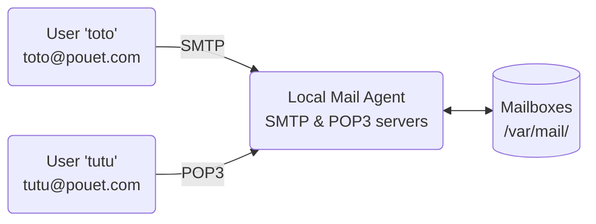

# Local Mail Agent

This repository contains [Dockerfile](Dockerfile) and [configuration
files](config/) for a Docker image, that runs a **local-only mail agent** on
Linux (Debian 12). This image is published in the [Docker
Hub](https://hub.docker.com/repository/docker/orel33/local-mail-agent). Besides,
this repository contains scripts to build & run this image.

To run this image, simply use:

```bash
$ docker run -it --hostname=pouet.com orel33/local-mail-agent
```

In our case, the `--hostname` option is really important because the chosen
 *hostname* will also be used as the mail domain name (or *mailname*). In the
following, we will assume that the chosen *hostname* is `pouet.com`.

## In few words

More precisely, this Dockerized mail agent consists of two servers:

* an SMTP server (Exim4) listening on ports 25 (plaintext) and 465 (TLS),
* a POP3 server (Dovecot) listening on ports 110 (plaintext) and 995 (TLS).

*Nota Bene*: The server that lets you send mail is called an *outgoing* server,
or SMTP server. The server that lets you receive mail is called an *incoming*
server, or POP3 server.

Both servers are configured to work with or without a secure TLS connection
(*snakeoil* certificate), with or without authentication (using *login*).

For the purposes of the demo, the Docker image has two user accounts `toto`
(password `toto`) and `tutu` (password `tutu`), associated with email accounts
`toto@pouet.com` and `tutu@pouet.com` respectively. In this *local-only*
configuration, the `pouet.com` domain is fictitious, and can only be used
locally on the Docker machine.

In short, `toto@pouet.com` can send an email to `tutu@pouet.com` (via the SMTP
protocol). And symmetrically, `tutu@pouet.com` can receive this email (via the
POP3 protocol).



**TODO**: Explain the figure. MUA (Mail User Agent), MTA (Mail Transfer Agent),
MDA(Mail Delivery Agent). The MUA is the email client used by the end-user, the
MTA  is responsible for the transfer of emails between servers, and the MDA
handles the final delivery of emails to the recipient's mailbox. These
components work together to facilitate the sending, routing, and receiving of
emails in an email system.

For each user, both servers are linked locally to the same mailbox, which is
stored in the `/var/mail/` directory in *mbox* format. This mailbox can be
accessed directly, by logging into the user account on the Docker machine, and
using a command-line mail client, such as `mutt` or `mail`.

## Demo

### Inside Docker

The advantage of this Docker image is that it allows you to launch our *local
mail agent* in a container without root privileges, or having its own domain
name (DNS). By the way, if you change the configuration of the servers in the
Docker container, there's no risk of breaking anything in the host system.

Let's start by launching the Docker image.

```bash
$ docker run -it --hostname=pouet.com orel33/local-mail-agent
```

You are logged in as *root* in the Docker container. Check with *netstat* that
the servers have started successfully...

```bash
root@pouet$ netstat -tlpn
Proto Local Address     Foreign Address    State     Program name
tcp   0.0.0.0:25        0.0.0.0:*          LISTEN    exim4
tcp   0.0.0.0:465       0.0.0.0:*          LISTEN    exim4
tcp   0.0.0.0:110       0.0.0.0:*          LISTEN    dovecot
tcp   0.0.0.0:995       0.0.0.0:*          LISTEN    dovecot
root@pouet$
```

Great! Now, let's send an email from `tutu@pouet.com` to `toto@pouet.com` by
using the `mail` command. But first, you need to log in as the 'tutu' user
within the container.

```bash
root@pouet$ su tutu
tutu@pouet$ echo "Testing message." | mail -s "test" toto@pouet.com
tutu@pouet$ exit
root@pouet$ su toto
toto@pouet$ mail
"/var/mail/toto": 1 message 1 new
>N   1 tutu@pouet.com     Fri Nov 10 11:47  16/462   test
? q
toto@pouet$ exit
root@pouet$
```

Simply type `exit` as `root` to exit the Docker container.

### Outside Docker

Now let's try using our *mail agent* outside the Docker container.

```bash
$ docker run -it --hostname=pouet.com -p 10025:25 -p 10465:465 -p 10110:110 -p 10995:995 orel33/local-mail-agent
root@pouet:/home/docker#
```

Indeed, it is possible to make both the SMTP & POP3 servers available outside of
the Docker world, listening on alternative ports (10110, 10995, 10025, 10465).
To do this, we use the option `-p x:y`, which makes a docker service listening
on port `y`, accessible on the host machine via the port `x`.

These options expose and map ports between the host machine and the container.
In this case:

* Port 10025 on the host is mapped to port 25 in the container (SMTP).
* Port 10465 on the host is mapped to port 465 in the container (SMTP over TLS)
* Port 10110 on the host is mapped to port 110 in the container (POP3).
* Port 10995 on the host is mapped to port 995 in the container (POP3 over TLS).

Thus, it is possible to connect the Docker SMTP server (port 25) outside from
the container by using Telnet, as follows:

```
$ telnet localhost 10025
```

This is particularly convenient to develop and test a *mail user agent* (MUA),
that implements clients for both SMTP & POP3 servers.

### Telnet Session

Let's assume that the Docker container is already running on the `ssss` machine
and that we are connected to the `cccc` machine, which may be `ssss` itself.
Now, let's send an email from `toto@pouet.com` to `tutu@pouet.com`. For this
demo, we just use a Telnet session (by hand) that connects to the SMTP server
(`ssss:10025`). In this case, we use an unsecure connection without any
authentication.

Here is the log of this Telnet session. The symbols `>` and `<` are used to
distinguish between lines of text sent or received over the network.

```
cccc$ telnet ssss 10025
Connected to ssss.
Escape character is '^]'.
< 220 pouet.com ESMTP Exim 4
> EHLO cccc
< 250-pouet.com Hello cccc
> MAIL FROM: <toto@pouet.com>
< 250 OK
> RCPT TO: <tutu@pouet.com>
< 250 Accepted
> DATA
< 354 Enter message, ending with "." on a line by itself
> Subject: Test
> From: <toto@pouet.com>
> To: <tutu@pouet.com>
> Testing message.
> .
< 250 OK
> QUIT
< 221 pouet.com closing connection
Connection closed by foreign host.
```

Let's now retrieve this email by using a Telnet session that connects to the
POP3 server (`ssss:10110`). In this case, we still use an unsecured connection,
but with authentication as shown on this log.

```
cccc$ telnet ssss 10110
Connected to ssss.
< +OK Welcome on Dovecot.
> USER tutu
< +OK
> PASS tutu
< +OK Logged in.
> STAT
< +OK 1 381
> LIST
< +OK 1 messages:
< 1 381
< .
> RETR 1
> +OK 381 octets
< From: <toto@pouet.com>
< To: <tutu@pouet.com>
< Subject: Test
<
< Testing message.
< .
> QUIT
< +OK Logging out.
Connection closed by foreign host.
```

### TLS Session

*to do*

---
